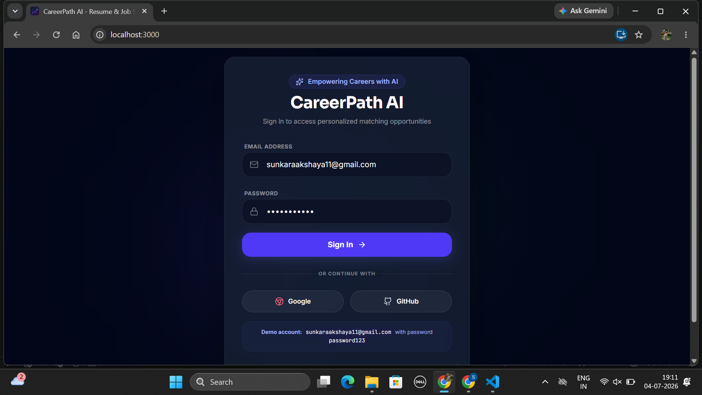
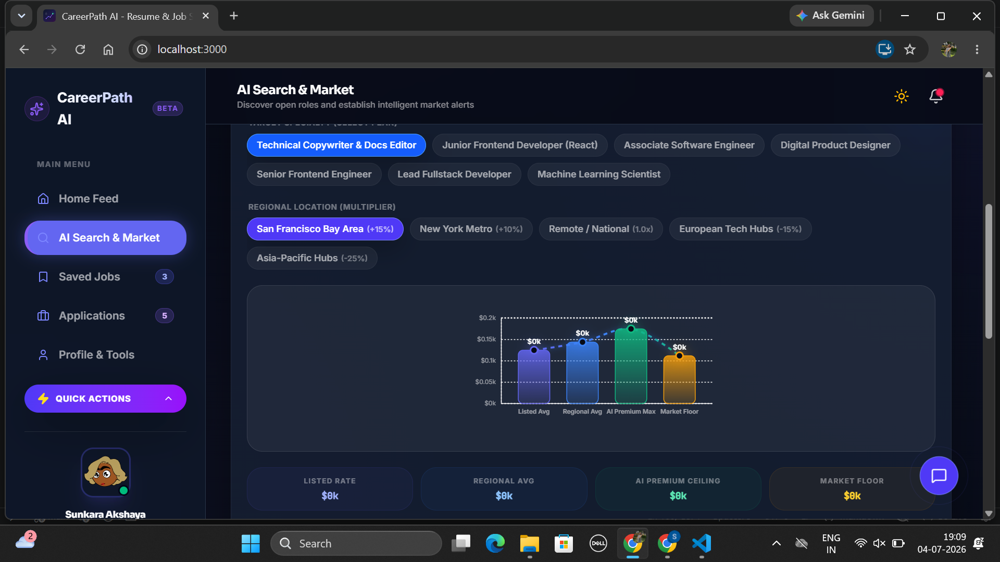
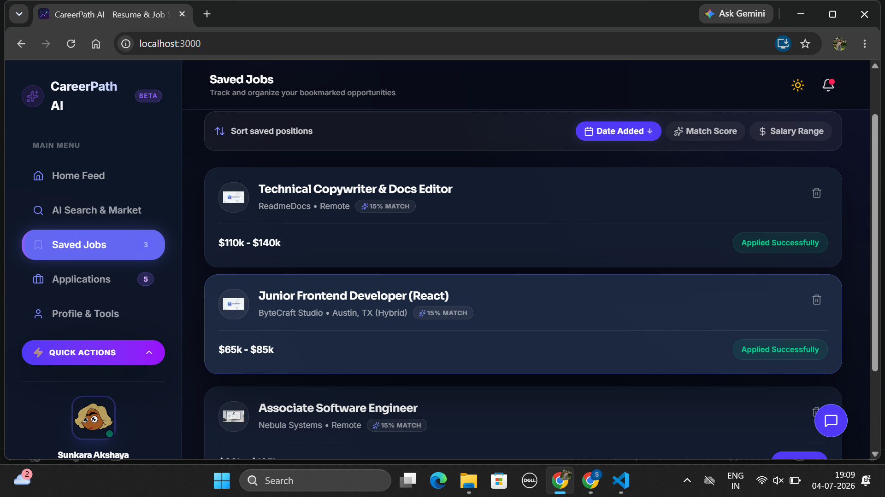
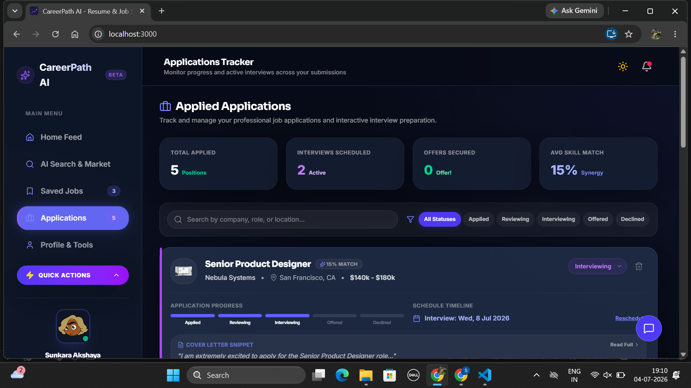
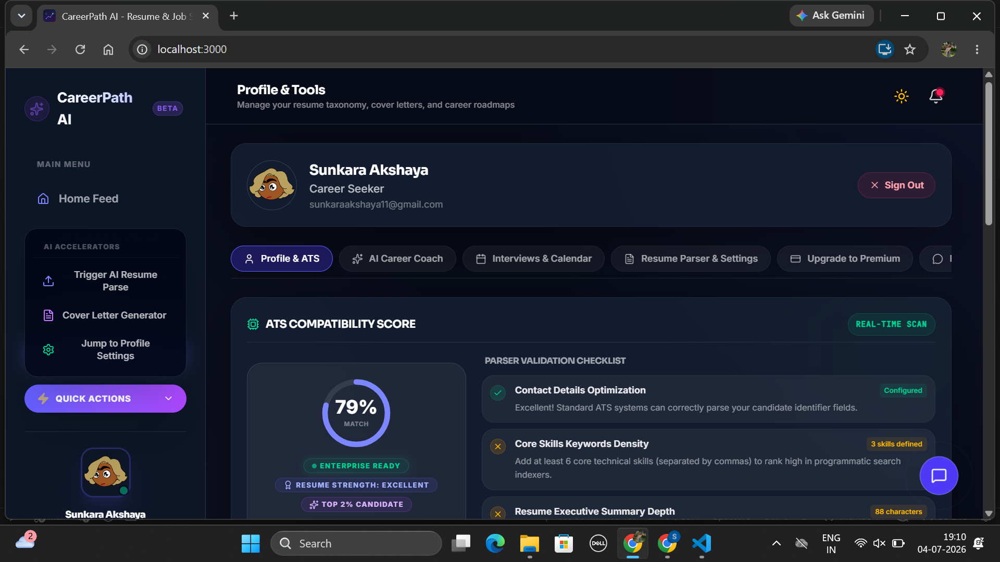

# CareerPath AI

CareerPath AI is a full-stack career assistant application built with React, TypeScript, Express, Prisma, and Vercel hosting. It combines resume parsing, ATS analysis, AI-powered cover letters, interview prep, job tracking, and career roadmap planning into a single workflow.

## Project Overview

CareerPath AI helps job seekers manage their professional profile, discover relevant roles, generate application materials, and prepare for interviews using a modern UI and GPT-style AI services.

The app includes:
- Resume profile builder with ATS compatibility scoring
- AI-powered resume parsing and refinement
- Career roadmap and skill gap analysis
- Custom cover letter generation
- Application and interview tracking
- Premium AI coaching features
- Search, save, and apply workflow

## Features

- **Profile & ATS Dashboard**: View profile strength, skill coverage, and resume analytics.
- **Resume Parser**: Upload or paste resume text and extract structured data.
- **Cover Letter Generation**: Generate tailored cover letters using Gemini AI.
- **Career Roadmap Planner**: Build a target career path with milestones and learning resources.
- **Skill Gap Analysis**: Compare existing skills with target job expectations.
- **Interview Prep**: Track scheduled interviews and generate prep prompts.
- **Job Tracking**: Save jobs, apply to roles, and manage application status.
- **AI Coach Bubble**: In-app coaching assistant for career and resume questions.
- **Authentication and Profile Management**: Sign in, update profile details, and save progress.

## Tech Stack

- **Frontend**: React, TypeScript, Vite, Tailwind-style CSS
- **Backend**: Express, serverless-http, Vercel Serverless Functions
- **API**: Gemini AI endpoints for resume parsing, cover letters, and career guidance
- **Database / Data**: Prisma + SQLite / PostgreSQL fallback via Prisma client, plus in-memory fallbacks
- **Deployment**: Vercel with `vercel.json` routing and static build support
- **CI/CD**: GitHub Actions build workflow on `main`

## Installation

### Prerequisites

- Node.js 22+
- npm
- Optional: Vercel CLI if deploying manually

### Local Setup

1. Clone the repository:
   ```bash
   git clone https://github.com/Akshaya-cpu/carrerpath-ai.git
   cd carrerpath-ai
   ```
2. Install dependencies:
   ```bash
   npm install
   ```
3. Create a local environment file:
   ```bash
   cp .env.example .env.local
   ```
4. Add required environment variables to `.env.local`:
   ```env
   GEMINI_API_KEY=your_gemini_api_key
   JWT_SECRET=your_jwt_secret
   APP_URL=http://localhost:3000
   SMTP_HOST=smtp.example.com
   SMTP_PORT=587
   SMTP_SECURE=false
   SMTP_USER=your_smtp_user
   SMTP_PASS=your_smtp_pass
   SMTP_FROM=no-reply@example.com
   ```
5. Run the development server:
   ```bash
   npm run dev
   ```
6. Open the app in your browser at `http://localhost:3000`.

### Build

```bash
npm run build
```

### Production Start

```bash
npm run start
```

## CI/CD Workflow

A GitHub Actions workflow is configured in `.github/workflows/deploy.yml`:

- Runs on `push` and `pull_request` events targeting `main`
- Uses `ubuntu-latest`
- Sets up Node.js 22
- Installs dependencies via `npm install`
- Runs `npm run build`

This workflow validates that the application builds successfully before merging or deploying.

## Vercel Deployment

The project uses `vercel.json` to configure deployment:

- `api/index.ts` is deployed as a Node serverless function using `@vercel/node`
- `package.json` is deployed as a static build using `@vercel/static-build`
- Build output directory is `dist`
- Routes:
  - `/api/*` => `/api/index.ts`
  - `/<file>` => `/dist/<file>`
  - all other requests => `/dist/index.html`

### Vercel Build Command

Vercel uses the `vercel-build` script defined in `package.json`:

```bash
npm run vercel-build
```

### Deployment Notes

- Ensure `GEMINI_API_KEY` is configured in Vercel environment variables.
- Optionally set `JWT_SECRET`, `APP_URL`, and SMTP variables for email and auth behavior.
- The app supports Express-based API routes through Vercel serverless functions.

## Folder Structure

```text
.
├── .github/
│   └── workflows/deploy.yml
├── api/
│   └── index.ts              # Vercel serverless function entrypoint
├── prisma/
│   ├── schema.prisma         # Prisma schema
│   └── seed.js               # Seed script for demo data
├── public/                   # Static assets and manifest
├── src/
│   ├── App.tsx               # Main React application
│   ├── main.tsx              # Vite entrypoint
│   ├── components/           # UI pages and shared components
│   ├── data/                 # Seed/mock job data
│   ├── server/               # Express app and API route handlers
│   ├── types.ts              # Shared TypeScript types
│   └── utils/                # Helper utilities and logic
├── server.ts                 # Express server setup and dotenv loading
├── tsconfig.json             # TypeScript configuration
├── package.json              # Project scripts and dependencies
└── vercel.json               # Vercel build and route config
```

## Screenshots









## Future Developments

Planned improvements for CareerPath AI:
- Add real-time job board integration with live ATS scoring for posted roles.
- Add user onboarding flows and guided career coaching journeys.
- Add team collaboration features for shared resume feedback and interview prep.
- Add richer analytics and visualization for skill gaps and roadmap progress.
- Add user settings for notification preferences, saved templates, and resume versions.
- Add multi-language support and international job-market insights.

---

## Notes

- The app contains premium AI-enabled workflows and fallback behavior for local or missing backend service access.
- If Prisma is unavailable, the server includes in-memory fallback behavior for jobs and auth.
- Use `npm run lint` to validate the project with TypeScript.
